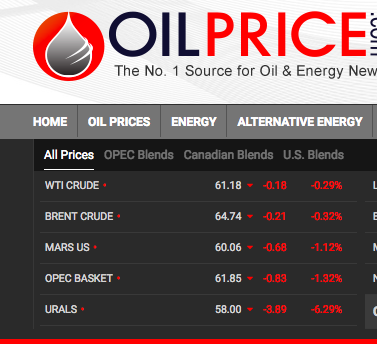

# README #

Lambda service to scrape the the Oil Price homepage, https://oilprice.com/, for data (see image below):


## Data structure
Data from the price table on the home page is gathered and formated in json (see example below):
``` python
[
	{
		'stream_time_offset': 'WTI Crude •11 mins', 
		'price': 61.18, 'change': -0.18, 
		'percent_change': '-0.29%', 
		'pull_dt': '2018-03-13 02:39:24.969774+00:00'
	}, 
	{
		'stream_time_offset': 'Brent Crude •11 mins', 
		'price': 64.74, 'change': -0.21, 
		'percent_change': '-0.32%', 
		'pull_dt': '2018-03-13 02:39:24.969774+00:00'
	} ...
]
```
## Resources
Data is writtend to 1 **S3** bucket named **daily-oil-price**

## Outputs
Objects written to s3 use the following syntax:
**price_Y-M-D_UTC_H:M:S.json**

## Scheduled Runs
Daily at 6am 

### Who do I talk to? ###

Creator: Andrew Bibian (ajbibian@gmail.com)
